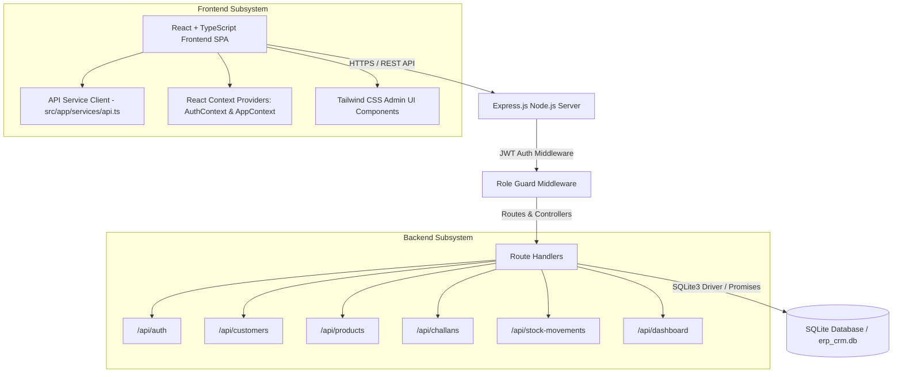
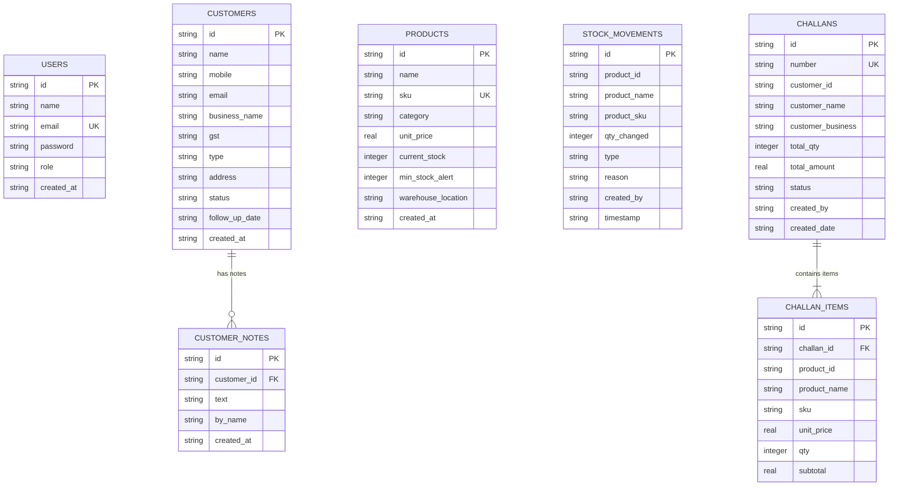

# Complete Technical Documentation: Full-Stack ERP & CRM System

Welcome to the comprehensive technical documentation for the **Full-Stack ERP & CRM System** designed for wholesale, distribution, and supply chain businesses.

This document serves as the authoritative blueprint detailing system architecture, data models, business logic implementations, API specifications, security protocols, and deployment strategies.

---

## 📋 Table of Contents
1. [Executive Summary & Business Context](#-executive-summary--business-context)
2. [Full System Architecture](#-full-system-architecture)
3. [Database Schema & ER Diagram](#-database-schema--er-diagram)
4. [Core Modules & Business Logic](#-core-modules--business-logic)
   - [1. Authentication & Role-Based Access Control (RBAC)](#1-authentication--role-based-access-control-rbac)
   - [2. Customer CRM Module](#2-customer-crm-module)
   - [3. Product & Inventory Module](#3-product--inventory-module)
   - [4. Sales Challan Module & Order Lifecycle](#4-sales-challan-module--order-lifecycle)
5. [Complete REST API Reference](#-complete-rest-api-reference)
6. [Frontend UI Architecture](#-frontend-ui-architecture)
7. [Deployment & Vercel Configuration](#-deployment--vercel-configuration)
8. [Automated Testing & Quality Assurance](#-automated-testing--quality-assurance)

---

## 🎯 Executive Summary & Business Context

### Business Problem
Wholesale and distribution companies manage high-volume B2B operations involving recurring customers, bulk inventory items, sales orders (challans), and stock movements across multiple warehouses. Manual tracking or fragmented tools lead to stockouts, inventory discrepancies, negative stock balances, lost follow-ups, and outdated pricing on historic orders.

### System Solution
This full-stack Enterprise Resource Planning (ERP) and Customer Relationship Management (CRM) platform unifies company operations under a centralized, role-gated platform:

- **Sales Teams** manage leads, active accounts, follow-up timelines, and generate sales challans.
- **Warehouse Teams** track stock levels, receive restock shipments (**IN**), dispatch orders (**OUT**), and monitor minimum threshold alerts.
- **Accounts Teams** review financial summaries, revenue metrics, and invoice challans.
- **Admins** oversee user roles, customer deletion, master product configurations, and system health.

---

## 🏗️ Full System Architecture

The application is structured as a full-stack mono-repository featuring a decoupled Node.js/Express REST API backend and a Vite/React SPA frontend.



### Directory Layout
```text
Full-stack ERP CRM/
├── DOCUMENTATION.md           # Master Technical Documentation
├── README.md                  # Quick Start & Setup Guide
├── package.json               # Root monorepo build & dev scripts
├── vite.config.ts             # Vite frontend build configuration
├── server/                    # Backend Subsystem
│   ├── package.json           # Backend dependencies & build scripts
│   ├── tsconfig.json          # Server TypeScript compilation config
│   ├── erp_crm.db             # Embedded SQLite Database instance
│   └── src/
│       ├── index.ts           # Express server entrypoint & CORS config
│       ├── db.ts              # Database connection, schema migrations & seed
│       ├── middleware/
│       │   └── auth.ts        # JWT verification & RBAC authorization middleware
│       └── routes/
│           ├── auth.ts        # /api/auth endpoints
│           ├── customers.ts   # /api/customers endpoints
│           ├── products.ts    # /api/products endpoints
│           ├── challans.ts    # /api/challans endpoints
│           ├── stockMovements.ts # /api/stock-movements endpoints
│           └── dashboard.ts   # /api/dashboard metrics endpoint
└── src/                       # Frontend Subsystem
    ├── main.tsx               # React application mounting point
    └── app/
        ├── App.tsx            # Main React application & view router
        └── services/
            └── api.ts         # Centralized HTTP API client with auth injection
```

---

## 🗄️ Database Schema & ER Diagram

The database utilizes SQLite with foreign key enforcement enabled (`PRAGMA foreign_keys = ON;`).



### Table Definitions

#### `users` Table
| Column | Type | Constraints | Description |
|---|---|---|---|
| `id` | TEXT | PRIMARY KEY | Unique user identifier (`U001`, `U002`, etc.) |
| `name` | TEXT | NOT NULL | User's full name |
| `email` | TEXT | UNIQUE, NOT NULL | Account email for login authentication |
| `password` | TEXT | NOT NULL | Hashed password (`bcrypt` salted hash) |
| `role` | TEXT | NOT NULL | `Admin` \| `Sales` \| `Warehouse` \| `Accounts` |
| `created_at` | TEXT | NOT NULL | ISO 8601 creation timestamp |

#### `customers` Table
| Column | Type | Constraints | Description |
|---|---|---|---|
| `id` | TEXT | PRIMARY KEY | Unique customer code (`C001`, `C002`, etc.) |
| `name` | TEXT | NOT NULL | Primary contact person name |
| `mobile` | TEXT | NOT NULL | Contact phone number |
| `email` | TEXT | NOT NULL | Contact email address |
| `business_name` | TEXT | NOT NULL | Company / Store name |
| `gst` | TEXT | DEFAULT '' | Tax identifier (Optional) |
| `type` | TEXT | NOT NULL | `Retail` \| `Wholesale` \| `Distributor` |
| `address` | TEXT | NOT NULL | Complete postal address |
| `status` | TEXT | NOT NULL | `Lead` \| `Active` \| `Inactive` |
| `follow_up_date` | TEXT | DEFAULT '' | Next scheduled sales contact date (`YYYY-MM-DD`) |
| `created_at` | TEXT | NOT NULL | Creation date timestamp |

#### `customer_notes` Table
| Column | Type | Constraints | Description |
|---|---|---|---|
| `id` | TEXT | PRIMARY KEY | Note ID (`CN001`, `CN_...`) |
| `customer_id` | TEXT | FK -> customers(id) | Associated customer record |
| `text` | TEXT | NOT NULL | Content of follow-up note |
| `by_name` | TEXT | NOT NULL | Name of user who added note |
| `created_at` | TEXT | NOT NULL | Display date and time |

#### `products` Table
| Column | Type | Constraints | Description |
|---|---|---|---|
| `id` | TEXT | PRIMARY KEY | Product ID (`P001`, `P002`, etc.) |
| `name` | TEXT | NOT NULL | Item commercial name |
| `sku` | TEXT | UNIQUE, NOT NULL | Stock Keeping Unit code (Uppercase) |
| `category` | TEXT | NOT NULL | Item category (*Grains*, *Edible Oils*, etc.) |
| `unit_price` | REAL | NOT NULL | Unit selling price in INR (₹) |
| `current_stock` | INTEGER | NOT NULL | Quantity currently available in warehouse |
| `min_stock_alert`| INTEGER | NOT NULL | Low stock notification threshold |
| `warehouse_location`| TEXT | NOT NULL | Aisle & Rack location (`A-01-R1`) |
| `created_at` | TEXT | NOT NULL | ISO creation timestamp |

#### `stock_movements` Table
| Column | Type | Constraints | Description |
|---|---|---|---|
| `id` | TEXT | PRIMARY KEY | Movement log ID (`SM001`, `SM_...`) |
| `product_id` | TEXT | NOT NULL | Reference product ID |
| `product_name` | TEXT | NOT NULL | Snapshot product name |
| `product_sku` | TEXT | NOT NULL | Snapshot product SKU |
| `qty_changed` | INTEGER | NOT NULL | Absolute quantity changed |
| `type` | TEXT | NOT NULL | Movement direction: `IN` \| `OUT` |
| `reason` | TEXT | NOT NULL | Audit explanation (PO #, Challan #, Adjustment) |
| `created_by` | TEXT | NOT NULL | Name of staff member executing movement |
| `timestamp` | TEXT | NOT NULL | Date and time string |

#### `challans` Table
| Column | Type | Constraints | Description |
|---|---|---|---|
| `id` | TEXT | PRIMARY KEY | Internal Challan ID (`CH001`, `CH_...`) |
| `number` | TEXT | UNIQUE, NOT NULL | Challan document number (`CH-2026-0001`) |
| `customer_id` | TEXT | NOT NULL | Associated customer ID |
| `customer_name` | TEXT | NOT NULL | Snapshot customer contact name |
| `customer_business`| TEXT | NOT NULL | Snapshot business name |
| `total_qty` | INTEGER | NOT NULL | Sum of all line item quantities |
| `total_amount` | REAL | NOT NULL | Total monetary value (₹) |
| `status` | TEXT | NOT NULL | Status: `Draft` \| `Confirmed` \| `Cancelled` |
| `created_by` | TEXT | NOT NULL | Sales representative name |
| `created_date` | TEXT | NOT NULL | Date string (`YYYY-MM-DD`) |

#### `challan_items` Table
| Column | Type | Constraints | Description |
|---|---|---|---|
| `id` | TEXT | PRIMARY KEY | Line item ID (`CHI001`, `CHI_...`) |
| `challan_id` | TEXT | FK -> challans(id) | Parent challan document |
| `product_id` | TEXT | NOT NULL | Product reference ID |
| `product_name` | TEXT | NOT NULL | **Snapshot** item name |
| `sku` | TEXT | NOT NULL | **Snapshot** SKU code |
| `unit_price` | REAL | NOT NULL | **Snapshot** price per unit |
| `qty` | INTEGER | NOT NULL | Ordered line quantity |
| `subtotal` | REAL | NOT NULL | Line item total (`unit_price * qty`) |

---

## ⚡ Core Modules & Business Logic

### 1. Authentication & Role-Based Access Control (RBAC)

#### Token Specifications
- **Algorithm**: HMAC-SHA256 (JWT standard).
- **Header format**: `Authorization: Bearer <JWT_TOKEN>`.
- **Payload Contents**: `{ id: string, name: string, email: string, role: string, exp: number }`.

#### Role Access Matrix
| Feature / Endpoint | Admin | Sales | Warehouse | Accounts |
|---|:---:|:---:|:---:|:---:|
| View Dashboard & Reports | ✅ | ✅ | ✅ | ✅ |
| View Customers & Details | ✅ | ✅ | ✅ | ✅ |
| Create / Edit Customers | ✅ | ✅ | ❌ | ❌ |
| Delete Customers | ✅ | ❌ | ❌ | ❌ |
| Add Customer Notes | ✅ | ✅ | ✅ | ✅ |
| View Products & Stock | ✅ | ✅ | ✅ | ✅ |
| Add / Edit Products | ✅ | ❌ | ✅ | ❌ |
| Adjust Stock (IN/OUT) | ✅ | ❌ | ✅ | ❌ |
| View Stock Movements Log| ✅ | ✅ | ✅ | ✅ |
| Create / Edit Challans | ✅ | ✅ | ❌ | ❌ |
| Confirm / Cancel Challans| ✅ | ✅ | ❌ | ❌ |

---

### 2. Customer CRM Module

#### Customer Status Lifecycle
```
[ Lead ] ──(Successful Follow-up / Order)──> [ Active ]
   │                                             │
   └─────────────(Account Paused)───────────────> [ Inactive ]
```

#### Key Capabilities
- **Multi-Attribute Search**: Searches across Name, Business Name, Mobile, Email, and ID simultaneously.
- **Follow-up Timeline**: Unlimited follow-up notes can be logged per customer. Each note tracks note text, creator name, and timestamp.

---

### 3. Product & Inventory Module

#### Low Stock Threshold Logic
A product is flagged with a **Low Stock Alert** badge whenever:
$$\text{current\_stock} \le \text{min\_stock\_alert}$$
The product list API supports filtering via `?alertOnly=true` to instantly isolate items needing reorder.

#### Stock Movement Audit Logging
Every manual stock entry/dispatch or automatic challan confirmation generates an immutable record in `stock_movements`:
$$\text{new\_stock} = \begin{cases} \text{current\_stock} + \text{qty\_changed} & \text{if Movement = IN} \\ \text{current\_stock} - \text{qty\_changed} & \text{if Movement = OUT} \end{cases}$$

---

### 4. Sales Challan Module & Order Lifecycle

#### Challan State Machine
```
           ┌─────────────── POST /api/challans (status='Draft') ───────────────┐
           │                                                                   │
           ▼                                                                   ▼
      [ DRAFT ] ──(POST /api/challans/:id/confirm)──> [ CONFIRMED ] ──(POST /api/challans/:id/cancel)──> [ CANCELLED ]
    (Stock Intact)                                    (Stock Reduced)                                (Stock Restocked)
```

#### Inventory Guard & Validation Rules
When a challan is created as `Confirmed` or transitioned from `Draft` to `Confirmed`:
1. The server performs a pre-transaction check across **all** requested items:
   $$\forall \text{ item } i, \quad \text{products}[i].\text{current\_stock} \ge \text{item}[i].\text{qty}$$
2. **If any item fails this check**:
   - The entire transaction is aborted.
   - The server responds with `HTTP 400 Bad Request`.
   - Error payload message format:
     `"Insufficient stock for product '<product_name>'. Available: <available_qty>, Requested: <requested_qty>"`
3. **If all items pass**:
   - Product stocks are decremented atomically:
     $$\text{products}[i].\text{current\_stock} \leftarrow \text{products}[i].\text{current\_stock} - \text{item}[i].\text{qty}$$
   - Stock movement audit records (**TYPE: OUT**) are inserted for each item.
   - Challan status changes to `Confirmed`.

#### Historical Snapshot Protection
`challan_items` stores historical snapshots of `product_name`, `sku`, and `unit_price` at the moment of order generation. If a product's price or name changes in the master catalog later, historical sales challans and financial audits remain 100% accurate.

---

## 📡 Complete REST API Reference

### Auth Endpoints

#### 1. User Login
- **URL**: `POST /api/auth/login`
- **Auth Required**: None
- **Request Body**:
  ```json
  {
    "email": "sales@distroerp.com",
    "password": "sales123"
  }
  ```
- **Response (200 OK)**:
  ```json
  {
    "token": "eyJhbGciOiJIUzI1NiIsInR5cCI6IkpXVCJ9...",
    "user": {
      "id": "U002",
      "name": "Priya Singh",
      "email": "sales@distroerp.com",
      "role": "Sales"
    }
  }
  ```
- **Response (401 Unauthorized)**:
  ```json
  { "error": "Invalid email or password." }
  ```

#### 2. Get Current Authenticated User
- **URL**: `GET /api/auth/me`
- **Auth Required**: Yes (`Bearer <token>`)
- **Response (200 OK)**:
  ```json
  {
    "user": {
      "id": "U002",
      "name": "Priya Singh",
      "email": "sales@distroerp.com",
      "role": "Sales"
    }
  }
  ```

---

### Customer Endpoints

#### 3. List Customers
- **URL**: `GET /api/customers`
- **Auth Required**: Yes
- **Query Parameters**:
  - `query` (optional): Search name, business, mobile, email
  - `status` (optional): `Lead` \| `Active` \| `Inactive`
  - `type` (optional): `Retail` \| `Wholesale` \| `Distributor`
  - `page` (optional): Default `1`
  - `limit` (optional): Default `50`
- **Response (200 OK)**:
  ```json
  {
    "data": [
      {
        "id": "C001",
        "name": "Vikram Patel",
        "mobile": "9876543210",
        "email": "vikram@pateltraders.com",
        "businessName": "Patel Traders Pvt Ltd",
        "gst": "27AABCP1234F1Z5",
        "type": "Wholesale",
        "address": "45 MG Road, Mumbai, MH 400001",
        "status": "Active",
        "followUpDate": "2026-08-15",
        "notes": [
          {
            "text": "Requested bulk discount on basmati rice.",
            "by": "Priya Singh",
            "at": "10 Aug 2026, 14:30"
          }
        ],
        "createdAt": "2025-01-10"
      }
    ],
    "pagination": { "total": 1, "page": 1, "limit": 50, "totalPages": 1 }
  }
  ```

#### 4. Create Customer
- **URL**: `POST /api/customers`
- **Auth Required**: Yes (Roles: `Admin`, `Sales`)
- **Request Body**:
  ```json
  {
    "name": "Rohan Gupta",
    "mobile": "9811223344",
    "email": "rohan@guptatraders.com",
    "businessName": "Gupta Enterprises",
    "gst": "07AAACG1122H1Z3",
    "type": "Wholesale",
    "address": "12 Connaught Place, New Delhi",
    "status": "Lead",
    "followUpDate": "2026-08-20",
    "notesText": "First inquiry via trade expo."
  }
  ```
- **Response (201 Created)**: Returns created customer object with assigned `id`.

#### 5. Add Customer Note
- **URL**: `POST /api/customers/:id/notes`
- **Auth Required**: Yes
- **Request Body**: `{ "text": "Called client, quote approved." }`
- **Response (200 OK)**: `{ "notes": [ ...updated notes array ] }`

---

### Product Endpoints

#### 6. List Products
- **URL**: `GET /api/products`
- **Auth Required**: Yes
- **Query Parameters**:
  - `query` (optional): Search name, SKU, category, location
  - `category` (optional): Category name filter
  - `alertOnly` (optional): `true` to list low stock items
  - `page`, `limit`
- **Response (200 OK)**:
  ```json
  {
    "data": [
      {
        "id": "P001",
        "name": "Basmati Rice Premium 25kg",
        "sku": "RICE-BAS-25K",
        "category": "Grains & Cereals",
        "unitPrice": 1850,
        "currentStock": 245,
        "minStockAlert": 50,
        "warehouseLocation": "A-01-R1",
        "createdAt": "2026-01-01T00:00:00.000Z"
      }
    ],
    "pagination": { "total": 1, "page": 1, "limit": 50, "totalPages": 1 }
  }
  ```

#### 7. Adjust Stock (IN/OUT)
- **URL**: `POST /api/products/:id/adjust-stock`
- **Auth Required**: Yes (Roles: `Admin`, `Warehouse`)
- **Request Body**:
  ```json
  {
    "qtyChanged": 50,
    "type": "IN",
    "reason": "Received Shipment PO-2026-089"
  }
  ```
- **Response (200 OK)**:
  ```json
  {
    "message": "Stock successfully adjusted IN by 50.",
    "productId": "P001",
    "previousStock": 245,
    "newStock": 295
  }
  ```

---

### Sales Challan Endpoints

#### 8. Create Sales Challan
- **URL**: `POST /api/challans`
- **Auth Required**: Yes (Roles: `Admin`, `Sales`)
- **Request Body**:
  ```json
  {
    "customerId": "C001",
    "items": [
      { "productId": "P001", "qty": 10 },
      { "productId": "P002", "qty": 5 }
    ],
    "status": "Confirmed"
  }
  ```
- **Response Success (201 Created)**:
  ```json
  {
    "id": "CH_1786389123000",
    "number": "CH-2026-0005",
    "customerId": "C001",
    "customerName": "Vikram Patel",
    "customerBusiness": "Patel Traders Pvt Ltd",
    "items": [
      {
        "productId": "P001",
        "productName": "Basmati Rice Premium 25kg",
        "sku": "RICE-BAS-25K",
        "unitPrice": 1850,
        "qty": 10,
        "subtotal": 18500
      }
    ],
    "totalQty": 15,
    "totalAmount": 26600,
    "status": "Confirmed",
    "createdBy": "Priya Singh",
    "createdDate": "2026-08-12"
  }
  ```
- **Response Stock Insufficient (400 Bad Request)**:
  ```json
  {
    "error": "Insufficient stock for product 'Refined Sunflower Oil 15L'. Available: 3, Requested: 5"
  }
  ```

#### 9. Confirm Draft Challan
- **URL**: `POST /api/challans/:id/confirm`
- **Auth Required**: Yes (Roles: `Admin`, `Sales`)
- **Response (200 OK)**: Returns updated confirmed challan document.

---

### Dashboard Metric Endpoints

#### 10. Get KPI Summary
- **URL**: `GET /api/dashboard/stats`
- **Auth Required**: Yes
- **Response (200 OK)**:
  ```json
  {
    "customers": { "total": 12, "active": 8, "leads": 3 },
    "inventory": { "totalProducts": 10, "lowStockAlerts": 2, "totalStockQty": 890 },
    "challans": { "total": 15, "confirmed": 12, "totalRevenue": 452100 },
    "recentMovements": [ ...5 latest movement items ],
    "recentChallans": [ ...5 latest challan items ]
  }
  ```

---

## 🎨 Frontend UI Architecture

The frontend is built using React 18, Tailwind CSS, and Lucide Icons.

### State Context Layer
- `AuthContext`: Manages logged-in user state, JWT tokens in `localStorage`, login logic, and logout.
- `AppContext`: Centralizes state for Customers, Products, Challans, Stock Movements, toasts, views, and syncs automatically with backend REST APIs via `src/app/services/api.ts`.

### View Routing
The single-page application manages view states without external page reloads:
- `dashboard`: Metrics overview, stock alert widgets, quick actions.
- `customers`: Customer directory, search, filter, creation/edit modals.
- `customer-detail`: Full profile view & follow-up note timeline.
- `products`: Product catalog, SKU manager, low-stock filter, stock adjustment modal.
- `challans`: Sales challans index table, search, status filters.
- `challan-detail`: Printable challan document view with line items.
- `create-challan`: Form to build multi-product sales challans with real-time total computation and stock feedback.
- `stock-movements`: Full inventory audit log with **IN** and **OUT** breakdown.

---

## 🚀 Deployment & Vercel Configuration

### Monorepo Vercel Build Setup

To deploy the application seamlessly on Vercel:

#### 1. Root `package.json` Scripts
```json
"scripts": {
  "dev": "concurrently \"npm run dev:server\" \"npm run dev:client\"",
  "dev:client": "vite",
  "dev:server": "cd server && npm run dev",
  "build": "vite build && cd server && npm install --include=dev && npm run build"
}
```

#### 2. Vercel Project Settings
- **Framework Preset**: Vite
- **Build Command**: `npm run build`
- **Output Directory**: `dist`

This ensures Vercel compiles the Vite React frontend into `dist/`, installs dependencies in `server/`, and compiles backend TypeScript via `npx tsc`.

---

## 🧪 Automated Testing & Quality Assurance

A dedicated automated requirements verification test suite is included in `server/test-all-requirements.js`.

### Running the Audit Suite
```bash
# Start backend server
npm run dev:server

# Run audit in separate terminal
node server/test-all-requirements.js
```

### Audit Verification Scope
- ✅ **JWT Authentication**: Validates tokens for Admin, Sales, Warehouse, Accounts.
- ✅ **Customer Management**: Verifies customer addition, detail lookup, note timeline appending, and status updates.
- ✅ **Product Stock Control**: Tests product creation, uppercase SKU enforcement, manual stock IN/OUT adjustments, and audit log generation.
- ✅ **Challan Business Logic**: Verifies Draft order non-reduction, stock insufficiency HTTP 400 rejection, Confirmed order stock deduction, and Snapshot integrity.

---

*Documentation compiled and maintained for Full-Stack ERP/CRM System.*
